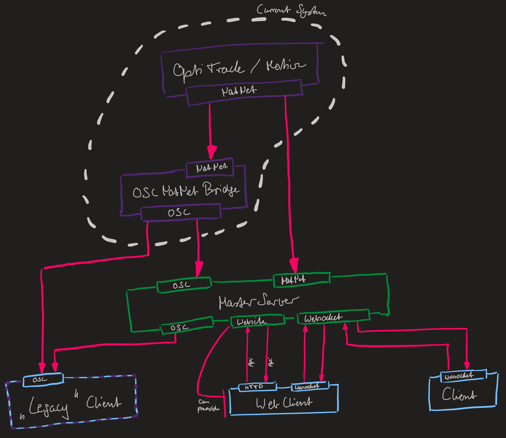

# Overall Networking / Server Structure

Here we describe the general server structure currently implemented.



###  Tracking input capabilities

Currently, the tracking information can be received in two ways, via
* NatNet can be received directly from the "Motive"
* OSC can be received from the current existing "OscNatNetBridge"
Since this implementation can also access the "Motive" the "Bridge" could be omitted.

### Tracking output capabilities

The tracking information can be send via:
* OSC. This emulates the old "OscNatNetBridge"
* Websocket. The events for this can be found in the [JsonRpc README](./EventHandling/README.md).

---

## Websocket

Since the class is a singleton, an object doesn't has to be created.
To access the *WebsocketClientWrapper* or *WebsocketServerWrapper*, you only have to access the instance.

```csharp
// For the server.
WebsocketServerWrapper.Instance. ...
// For the client.
WebsocketClientWrapper.Instance. ...
```

### Client vs Server

There are two different implementations for the websocket.
A server and a client implementation.
The server application is only needed for a real server or for a combined server-client architecture.
However, both classes have in general the same method structure.

### Start up

The websocket server or client can be started the following way.
Additional, the *WebsocketClient* has to deliberately connect to the server.

```csharp
// For the server.
WebsocketServerWrapper.Instance.StartServer(
    port: 3100
);
// For the client.
WebsocketClientWrapper.Instance.StartClient(
    ip: "141.76.67.175",
    port: 3100,
    address: "/JsonRpcService" // This exact address has to be used to connect to the right websocket on the server.
);
WebsocketClientWrapper.Instance.ConnectClient();
```

Both can also stopped again.

```csharp
// For the server.
WebsocketServerWrapper.Instance.StopServer();
// For the client.
WebsocketClientWrapper.Instance.DisconnectClient();
WebsocketClientWrapper.Instance.StopClient();
```

### Send messages

Both, client and server, can send messages.
For this a *JsonRpcMessage* is needed (see **Json Rpc Message** in [README](_README/GeneralServerStructure.png)).
The *WebSocketServer* needs more information to send the message to the correct clients (see **JsonRpc Server structure** in [README](_README/GeneralServerStructure.png)).

However, all the sending should be done by the *JsonRpcHandler* for the time being (see **Send new json rpc events** in [README](_README/GeneralServerStructure.png))

```csharp
JsonRpcMessage newMessage;
// For the server.
WebsocketServerWrapper.Instance.Send(
    message: newMessage,
    ccType: ClientConnectionType.Desktop,
    connectionName: "Marc's PC"
);
// For the client.
WebsocketClientWrapper.Instance.Send(
    message: newMessage
);
```

## Website / HTTP

The server also supports the delivering of websites.
All the website content should be placed in the __HTML__ folder in the project root.

Since the class is a singleton, an object doesn't has to be created.
To access the *WebsocketClientWrapper* or *WebsocketServerWrapper*, you only have to access the instance.

```csharp
// For the server.
WebServerWrapper.Instance. ...
```

### Start up

The server has to started before the server can be reached and deliver websites.
Further, to allows the api interface to work, further information has to be provided to the *WebServerWrapper*.

```csharp
// Start the server.
WebServerWrapper.Instance.StartServer(1234);
// Add more information for the api.
WebServerWrapper.Instance.SetApiInformation(
    wsUrl: "141.76.67.175", 
    wsPort: 3100
);
```

### Accessing the API 

The *WebServerWrapper* also provides an API interface.
This can be accessed by ``/api``.
Currently two api get requests are available:
* ``/wsIp`` The ip of the *WebSocketServerWrapper*.
* ``/wsPort`` The port of the *WebSocketServerWrapper*.
