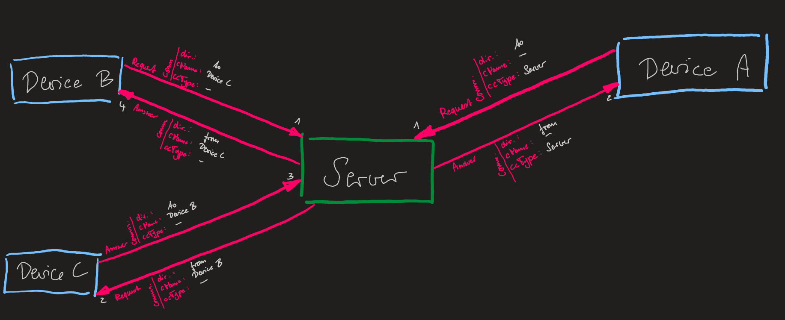
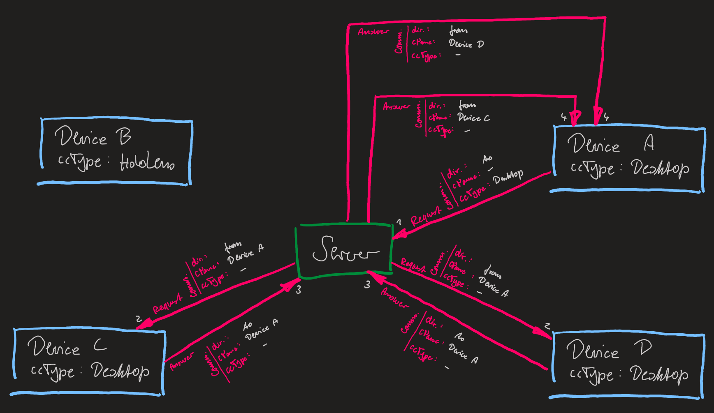

# JsonRpc Server structure

Our websocket is based on the json rpc protocol.
Further, the server allows us to receive, send, handle, and tunnel arbitrary events from any connected device to another.
Additional, the server itself can also be used as an additional client.

We added a *Communication* structure to allow a message to be send to an arbitrary device (see [The "Communication" property](#The-"Communication"-property)).

In the following images, we use the following abbreviations:
* comm. --> communication - The communication object in a *JsonRpcMessage* object.
* dir. --> direction - A property of a *JsonRpcCommunication* object.
* cName --> connectionName - A property of a *JsonRpcCommunication* object.
* ccType --> clientConnectionType - A property of a *JsonRpcCommunication* object.


These image shows two way how to communicate via the websocket/json rpc protocol.
On the **right**, the client sends a message directly (1) to the server and receives an answer (2).
On the **left**, the "Device B" sends a request to another client: "Device C" (1).
The "Server", receives this request and tunnels it directly to "Device C" (2).
"Device C" gives an answer (3) and the "Server" tunnels it again (4).


This image shows another communication example.
"Device A" sends a request to all "Desktop" clients (1).
The "Server" tunnels the message and sends it to each connect "Desktop" client (2).
"Device C" and "Device D" receive the message, both send an answer (3), which will be tunneled by the "Server" to the request sender "Device A" (4).

---

## Json Rpc Message

The class *JsonRpcMessage* and its object represent an received message or a message to send.
This message contains all necessary properties that can be be mapped from and unto a json string.
For a general structure of the jsonRpc string, please refer to the [Json Rpc Description](#Json-Rpc-Description) below.

### Creating of message

The message can be created in different ways.
First, the constructors of the class itself can be used.
Those should be used if a complete new message should be created.
Those messages are always from the type "Request".

```csharp
// Create a new request.
// Either with a string for the message name ...
JsonRpcMessage message = new JsonRpcMessage(
	data: new JObject(),
	method: "this is an event name"
);
// ... or with a predefined event.
JsonRpcMessage message = new JsonRpcMessage(
	data: new JObject(),
	method: JsonRpcEvent.DeviceRegistration
);
```

It's alo possible to create new messages based on an existing one. 
This can be used for either an answer, or to create a "tunnel" message for the server.
In general, the second option is only relevant for the server itself.

```csharp
JsonRpcMessage message;
// Create an answer for a received request.
// This is the only way to generate a message with the type "Answer".
JsonRpcMessage answerMessage = message.CreateAnswerMessage(
	data: new JObject(),
	server: false // Default value is: false. This is only be used if this answer was generated by the server.
);

// Create a tunnel message.
JsonRpcMessage tunnelMessage = message.CreateTunnelMessage(
	service: WebSocketService
)
```

### Deserialization

Lastly, there is also the possibility to create a new *JsonRpcMessage* object out of an string or JObject.

```csharp
// Create a new message object.
// Either by string ...
JsonRpcMessage message = JsonRpcMessage.DeserializeMessage(
	message: "..."
);
// ... or by JObject.
JsonRpcMessage message = JsonRpcMessage.DeserializeMessage(
	message: new JObject()
);
```

### JObject Casting

To generate a *JObject* out of an *JsonRpcMessage* you can use the following method.

```csharp
JsonRpcMessage message;
// Creates a JObject out of this message.
JObject jObject = message.ToJObject();
// Generates a string from an JObject.
string messageString = jObject.ToString();
```

### The "Communication" property

The *JsonRpcMessage* has one additional property that is necessary to allow a correct handling of the message over the server.
The *JsonRpcCommunication* class has the following properties:

```csharp
JsonRpcCommunication communication;

// The direction the connected message has.
// Either "to": if the message should be send TO a specific other connection
// or "from"  : if the message was received FROM a specific other connection.
communication.Direction;
// The name this message was coming FROM or should be send TO.
communication.Name;
// The client type this message was coming FROM or should be send TO.
communication.ClientConnectionType;
```

---

## JSON Handler Usage

The *JsonRpcHandler* is strongly connect to the *webSocket wrappers*.
It provides a structure to create, handle, and send events to different listeners.

Since the class is a singleton, an object doesn't has to be created.
To access the *JsonRpcHandler*, you only have to access the instance.
```csharp
JsonRpcHandler.Instance. ...
```

### Start Up

Since the *json handler* is connected to the websocket implementation, it is necesary to decide if this *JsonRpcHandler* is connected to the server or to the client webSocket wrapper.
For this, we have to deliberatly start the *JsonRpcHandler* by connecting it to either wrapper:
```csharp
// Connect the JsonRpcHandler to a client.
JsonRpcHandler.Instance.ConnectToClient();

// Connect the JsonRpcHandler to a server.
JsonRpcHandler.Instance.ConnectToServer();
```

It is also possible to disconnect the *JsonRpcHandler* from the wrappers:
```csharp
// Connect the JsonRpcHandler to a client.
JsonRpcHandler.Instance.DisconnectFromClientr();

// Connect the JsonRpcHandler to a server.
JsonRpcHandler.Instance.DisconnectFromServer();
```

### Delegate usage

The *JsonRpcHandler* can provide and send different messages over the registered connection.
To register an listener to an arbitrary event (string) or to a *json rpc event*, the following methods can be called.
```csharp
// Add a notification listener.
// Either by string ...
JsonRpcHandler.Instance.AddNotificationDelegate(
	rpcEvent: "this is an event name", 
	notification: requestListenerMethod
);
// ... or by a predefined event.
JsonRpcHandler.Instance.AddNotificationDelegate(
	rpcEvent: JsonRpcEvent.DeviceRegistration
	notification: requestListenerMethod
);

// Add a request listener.
// Either by string ...
JsonRpcHandler.Instance.AddRequestDelegate(
	rpcEvent: "this is an event name", 
	request: requestListenerMethod
);
// ... or by a predefined event.
JsonRpcHandler.Instance.AddRequestDelegate(
	rpcEvent: JsonRpcEvent.DeviceRegistration
	request: requestListenerMethod
);

// Add a request listener.
// Either by string ...
JsonRpcHandler.Instance.AddAnswerDelegate(
	rpcEvent: "this is an event name", 
	answer: answerListenerMethod
);
// ... or by a predefined event.
JsonRpcHandler.Instance.AddAnswerDelegate(
	rpcEvent: JsonRpcEvent.DeviceRegistration
	answer: answerListenerMethod
);
```

There is also an additional parameter available for those methods.
This parameter allows to only register such an listener in such a way, that this listener methods is only called **once**.

```csharp
// If oneTime is true, this listener will only be called by the next occurence of the event.
// Afterwards it will be removed.
JsonRpcHandler.Instance.AddAnswerDelegate(
	rpcEvent: "this is an event name", 
	request: answerListenerMethod,
	oneTime: true
);
```

Delegates can also be removed:
```csharp
// Remove a notification listener.
JsonRpcHandler.Instance.RemoveNotificationDelegate(eventName, _onRequest_EmulatedOptiTrackMessage);

// Remove a request listener.
JsonRpcHandler.Instance.RemoveRequestDelegate(eventName, _onRequest_EmulatedOptiTrackMessage);

// Remove an answer handle
JsonRpcHandler.Instance.RemoveAnswerDelegate(eventName, _onRequest_EmulatedOptiTrackMessage);
```

### Receiving

All listeners connected to the *JsonRpcHandler* should have the following delegate type.
The listeners always receive a *[JsonRpcMessage](#Json-Rpc-Message)*.

```csharp
public delegate void JsonRpcMessageEventHandler(JsonRpcMessage message);
```

### Send new json rpc events

The *JsonRpcHandler* also allows us to send new messages.
For this purpose the following methods can be used.

```csharp
JsonRpcMessage newMessage;
// To send a notification.
JsonRpcHandler.Instance.SendNotification(
	message: message,
	ccType: ClientConnectionType.Desktop, // Default value is: null.
	connectionName: "PC" // Default value is: null.
);

// To send a request.
JsonRpcHandler.Instance.SendRequest(
	message: message,
	ccType: ClientConnectionType.Desktop, // Default value is: null.
	connectionName: "PC" // Default value is: null.
);

// To send an answer.
JsonRpcHandler.Instance.SendAnswer(
	message: message,
	ccType: ClientConnectionType.Desktop, // Default value is: null.
	connectionName: "PC" // Default value is: null.
);
```

---

## Json Rpc Description

JSON RPC has a predefined structure to make Remote Process Calls. 
For a further description look at: https://en.wikipedia.org/wiki/JSON-RPC

We also use the same structure, but altered it by adding additional arguments.
Both message types got a new structure for the "params" and "results" object inside the message.
The "data" argument will be more closely describes by the specific predefined events (see [Predefined JsonRpcEvent](#Predefined-JsonRpcEvent)).

### Notification message structure

```json
{
	"jsonrpc": 2.0,
	"method": "Procedure Name",
	"params": 
	{
		"data": "JSON Dict with key-value pairs",
		"communication": 
		{
			"direction": "Either 'from' or 'to'",
			"name": "The name of the device this message should be send to",
			"clientConnectionType": "The device type this message should be send to"
		},
	}
}
```

### Request message structure

```json
{
	"jsonrpc": 2.0,
	"method": "Procedure Name",
	"params": 
	{
		"data": "JSON Dict with key-value pairs",
		"communication": 
		{
			"direction": "Either 'from' or 'to'",
			"name": "The name of the device this message should be send to",
			"clientConnectionType": "The device type this message should be send to"
		},
	},
	"id": "An id of the method."
}
```

### Answer message structure

```json
{
	"jsonrpc": 2.0,
	"result": "JSON Dict with key-value pairs"
	{
		"data": "JSON Dict with key-value pairs",
		"method": "The procedure name this message is the answer to.",
		"communication": 
		{
			"direction": "Either 'from' or 'to'",
			"name": "The name of the device this message should be send to",
			"clientConnectionType": "The device type this message should be send to"
		},
	},
	"id": "Id of the request that caused this answer"
}
```

### General Notes

We added "communication" to allow us to specify where a message should be going to.
The "communication" object is only necessary if the message is send to the **server**.
With this information the server can decide how to distribute those information.

If "name" or "clientConnectionType" are empty (not present or equal to null), it will not check for those values.
If both are empty, than the server sends this information to every open connection.
If the "clientConnectionType" is "Server", than this message is for the server and will not further distributed (see [JsonRpc Server structure](#JsonRpc-Server-structure)).

The "direction" value can be **to** or **from**.
**to** will be used when a client send a message to the server.
**from** will be used when the server sends a message to the clients.

## Predefined JsonRpcEvent

This description mainly contains the main available "JsonRpcEvents" from the enum with the same name.
All other registered events will have their own structure, which hav to be designed beforehand.
This descriptions is allways for the structure of the **"data"** object in both, requests and answers.

### DeviceRegistration

This has to be the first message a device sends to the server. 
If the registration was not successful, no further message will be handled.
The device knows that the registration was successful, when an answer with the same parameters was returned.

##### Request

```json
{
	"name": "Name of the device",
	"clientConnectionType": "Type of the device. This can be all types found in 'ConnectedDeviceType.cs'"
}
```

##### Answer

```json
{
	"name": "Name of the device",
	"clientConnectionType": "Type of the device. This can be all types found in 'ConnectedDeviceType.cs'"
}
```

### OptiTrackMessage

This only sends the information of the tracked devices in optitrack to all other devices.

##### Request

```json
{
	"rigidbody": 
	{
		"Id": "",
		"X": "",
		"X": "",
		"Z": "",
		"RotX": "",
		"RotY": "",
		"RotZ": "",
		"Quat0": "",
		"Quat1": "",
		"Quat2": "",
		"Quat3": "",
		"Name": "",
	}
}
```

### EmulatedOptiTrackMessage

This message should only be send to the server.
The server than will handle it as a "real" optiTrack event and will send the device information to all registered clients.
Clients that emulate such messages should always register as **_"EmulationDevice"**.

##### Request

```json
{
	"rigidbody": 
	{
		"Id": "",
		"X": "",
		"X": "",
		"Z": "",
		"RotX": "",
		"RotY": "",
		"RotZ": "",
		"Quat0": "",
		"Quat1": "",
		"Quat2": "",
		"Quat3": "",
		"Name": "",
	}
}
```

